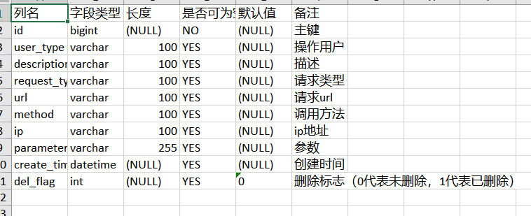
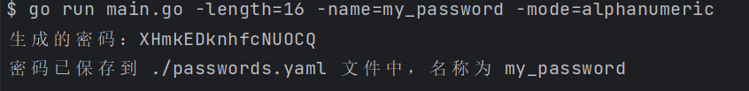

# Tool Box

A simple tool box

## mysql-to-excel

### 项目描述

MySQL数据表信息导出到Excel，包括：

- 列名
- 字段类型
- 长度
- 是否可为空
- 默认值
- 备注




## password-generator

### 项目描述

生成密码，有三种模式：

- 仅字母 alphanumeric  
- 字母和数字 mixedcase  
- 字母和数字、特殊字符 allchars

```shell
go run main.go -length=16 -name=my_password -mode=alphanumeric
go run main.go -length=16 -name=my_password -mode=mixedcasego run main.go -length=16 -name=my_password -mode=allchars  
go run main.go -length=16 -name=my_password -mode=allchars -name=wenlian`
```

  